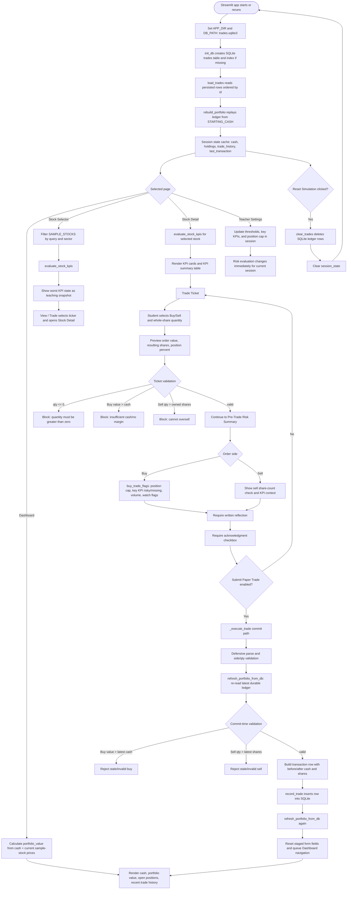

# Trading and Teaching App Data Flow, Edge Cases, and Test Coverage

This document redraws the app data flow around a single rule: **SQLite is the durable source of truth**. Streamlit session state should be treated as a view/cache that is rebuilt from the trade ledger after startup, reset, and each committed transaction.

## 1. End-to-End Data Flow Diagram



## 2. Commit Path Detail

```mermaid
sequenceDiagram
    participant Student
    participant UI as Streamlit UI
    participant App as app._execute_trade
    participant DB as SQLite trade_store
    participant Dash as Dashboard

    Student->>UI: Choose side, quantity, reflection, acknowledgment
    UI->>UI: Preview validation blocks zero qty, insufficient cash, oversell
    UI->>App: Submit Paper Trade
    App->>App: Convert qty to int; reject invalid side or qty <= 0
    App->>DB: load_trades(db_path)
    DB-->>App: Latest durable ledger rows
    App->>App: rebuild_portfolio(latest trades, STARTING_CASH)
    App->>App: Re-check buy cash and sell share availability
    alt Commit validation fails
        App-->>UI: Show error and do not insert
    else Commit validation succeeds
        App->>DB: record_trade(transaction)
        DB-->>App: new autoincrement id
        App->>DB: load_trades(db_path)
        DB-->>App: Reloaded ledger with committed row
        App->>App: rebuild cash, holdings, trade_history
        App->>UI: Reset form state and route to Dashboard
        UI->>Dash: Show latest cash, positions, and history
    end
```

## 3. Edge Cases Covered

| Area | Edge case | Required handling | Test coverage |
|---|---|---|---|
| Startup | `trades.sqlite3` does not exist | Create database/table/index, load empty ledger, start with `$100,000` and no holdings | `test_new_database_loads_empty_and_rebuilds_starting_cash`, `test_init_db_creates_missing_parent_directory` |
| Startup/reload | Existing ledger from prior app run | Load rows ordered by id and replay into cash/holdings deterministically | `test_buy_sell_sequence_persists_reloads_and_rebuilds_cash_and_holdings`, `test_rebuild_portfolio_is_deterministic_across_multiple_loads` |
| Buy | Quantity is zero or negative | Block before commit; DB also rejects qty <= 0 | `test_sqlite_constraints_reject_invalid_trade_rows` |
| Buy | Order value exceeds available cash | Block before commit and again after re-reading latest ledger; no margin allowed | `test_no_margin_rule_is_detected_by_integrity_helper_when_app_is_bypassed` |
| Sell | Quantity exceeds currently owned shares | Block before commit and again after re-reading latest ledger | `test_direct_oversell_row_is_detected_by_integrity_helper` |
| Sell | Full liquidation brings shares to zero | Remove the ticker from open holdings | `test_full_liquidation_removes_zero_share_position` |
| Multiple trades | Buy/buy/sell sequence across tickers | Cash, shares, persisted history, and replay result must agree | `test_buy_sell_sequence_persists_reloads_and_rebuilds_cash_and_holdings` |
| Reset | Student/teacher clicks Reset Simulation | Delete persisted trade rows, clear session, reload starting state | `test_clear_trades_resets_ledger_to_starting_cash` |
| Ledger IDs | Multiple inserts | Row ids increase and load order matches execution order | `test_autoincrement_ids_are_in_execution_order` |
| Schema constraints | Bad side, zero qty, negative price/value/shares | SQLite should reject rows that violate declared constraints | `test_sqlite_constraints_reject_invalid_trade_rows` |
| Corruption/bypass | A row has wrong value, wrong cash_after, oversell, or no-margin buy inserted directly | Strong test helper detects drift even when raw DB insert would otherwise succeed | `test_inconsistent_cash_or_trade_math_is_detected_by_integrity_helper`, `test_direct_oversell_row_is_detected_by_integrity_helper`, `test_no_margin_rule_is_detected_by_integrity_helper_when_app_is_bypassed` |
| Teaching/risk | Missing KPI data | Never silently classify missing as safe | `test_missing_kpi_is_not_classified_as_safe` |
| Teaching/risk | Boundary values around Watch/Risky thresholds | Document and test current strict-boundary behavior | `test_higher_is_riskier_classification_edges`, `test_lower_is_riskier_classification_edges` |
| Teaching/risk | Buy creates oversized concentration | Flag resulting total position, including existing shares | `test_position_cap_flag_uses_resulting_total_position` |
| Teaching/risk | Key KPI is risky or missing | Show separate Risky/Missing flags | `test_key_kpi_risky_and_missing_generate_buy_flags` |
| Teaching/risk | Average dollar volume below Watch threshold | Create explicit liquidity flag without duplicate generic KPI flag | `test_average_dollar_volume_below_watch_generates_trade_flag_without_duplicate_generic_flag` |
| Teaching/risk | Multiple flags | Sort Risky first, Missing next, Watch last | `test_order_flags_sorted_places_risky_then_missing_then_watch` |

## 4. Recommended Hardening Items

These are not required to run the tests, but they would make the app more robust:

1. Move commit validation into a pure function, for example `validate_and_build_trade(...)`, so it can be unit-tested without Streamlit.
2. Reject non-integer numeric quantities explicitly instead of relying only on Streamlit's whole-share widget and `int(qty)` conversion.
3. Consider adding a database-level or application-level integrity checker that verifies:
   - `value == qty * price`
   - `cash_before` equals the replayed cash before the row
   - `cash_after` equals the replayed cash after the row
   - `shares_before` equals replayed ticker shares before the row
   - `shares_after` equals replayed ticker shares after the row
   - buys never make cash negative
   - sells never make holdings negative
4. Consider storing a `schema_version` or `app_version` if the classroom app will evolve.
5. Keep teacher settings as session-only unless a future requirement says thresholds should persist across classes.

## 5. Test Commands

From your project root, after copying the two test files into `tests/`:

```bash
python -m pytest -q tests/test_trading_cash_integrity.py tests/test_risk_engine_teaching_rules.py
```

To run against nonstandard filenames:

```bash
TRADE_STORE_PATH=./trade_store.py RISK_ENGINE_PATH=./risk_engine.py python -m pytest -q tests/
```
